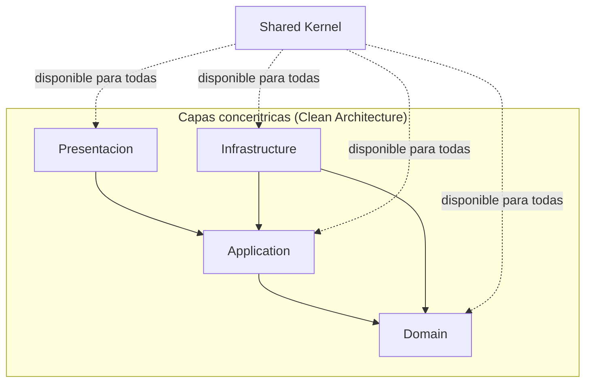

# Arquitectura

> Documento compartido: gestionado por el harness y sincronizado en todos los proyectos.
> No lo edites manualmente en este repo — los cambios se sobrescribirán en el próximo `sync`.

## Visión general

Este proyecto sigue una **Clean Architecture** combinada con **Domain-Driven Design (DDD)**
en la capa de dominio. El objetivo es que la lógica de negocio sea independiente de
frameworks, bases de datos, UI o cualquier detalle técnico externo, de forma que esos
detalles técnicos sean intercambiables sin tocar el núcleo del sistema.

El sistema se organiza en cuatro capas concéntricas — Presentación, Infrastructure,
Application y Domain — más un **Shared Kernel** transversal que actúa como cimiento
disponible para todas ellas.



*(Las flechas indican dirección de dependencia: A → B significa "A depende de B".)*

## Regla de dependencia

**Las dependencias de código siempre apuntan hacia el Domain.** Ninguna capa interior
conoce nada de las capas exteriores:

- `Domain` no depende de ninguna otra capa (salvo `Shared Kernel`).
- `Application` depende solo de `Domain` (y `Shared Kernel`).
- `Infrastructure` depende de `Application` y `Domain`, además de los frameworks y
  librerías externas que necesite.
- `Presentación` depende de `Application` — no accede a `Infrastructure` ni a `Domain`
  directamente.

Cuando una capa interior necesita algo que solo puede resolver una capa exterior (por
ejemplo, `Domain` necesita persistir una entidad), **no se rompe la regla dependiendo
hacia afuera**: la capa interior define una interfaz (puerto) y la capa exterior la
implementa (adaptador). Este es el **Principio de Inversión de Dependencias**: el flujo
de control puede ir hacia afuera, pero la dependencia de código siempre apunta hacia
adentro.

### Aplicación técnica de la regla: ArchUnit

**El proyecto es un único módulo JPMS**, con un solo `src/main/java` y un solo
`module-info.java`. Los anillos son paquetes dentro de ese árbol, no módulos Java
separados.

Eso tiene una consecuencia que conviene saber: **el compilador no impide que `domain`
importe `infrastructure`**. Dentro de un mismo módulo Java todos los paquetes se ven
entre sí, así que la regla de dependencia no es una restricción del compilador.

Quien la sostiene es **ArchUnit**, que la verifica en la suite de tests junto con las
reglas que el compilador nunca habría podido expresar (convenciones de nombres y
paquetes, "las entidades no pueden depender de los value objects de otro agregado", y
demás). Falla el build igual, pero en la fase de tests y no en la de compilación: si
`gradle build` está en verde, la regla se cumple.

El `module-info.java` sigue cumpliendo su función hacia fuera — declarar de qué depende
el proyecto y qué expone — pero no hacia dentro.

## Las capas

### 1. Shared Kernel

Código transversal que actúa como framework de desarrollo propio. Es **idéntico en
todos los proyectos** y no cambia por dominio — no contiene ninguna lógica de negocio
específica de un proyecto.

Contiene, entre otros:
- Tipos base para DDD (`Entity`, `ValueObject`, `AggregateRoot`)
- Primitivas de resultado/error (`Result`, excepciones base de dominio)
- Utilidades de validación (guard clauses)
- Contratos base transversales (ej. `DomainEvent`)

Todas las demás capas pueden depender de `Shared Kernel`. `Shared Kernel`, a su vez, no
depende de ninguna capa ni de nada específico de un proyecto concreto.

> **Distribución (decidida):** dado que cada módulo es un repositorio Git independiente
> sin librerías compartidas, `Shared Kernel` no se copia dentro de cada módulo. Es un
> proyecto Gradle propio que se construye una vez y se publica como artefacto
> versionado (`dev.sharedkernel:sharedkernel:<version>`) en el repositorio Maven local
> estándar (`~/.m2`, vía `publishToMavenLocal`). Cada módulo lo consume declarando
> `mavenLocal()` como repositorio y la dependencia con versión fijada — exactamente
> como consumiría cualquier librería externa. Así se garantiza que es *literalmente* el
> mismo código en todos los proyectos, sin romper el aislamiento: el módulo solo ve un
> jar versionado con coordenadas neutras, sin rastro del sistema al que pertenece.

### 2. Domain

El corazón del sistema. Contiene toda la lógica de negocio, modelada con DDD (ver
[ddd-conventions.md](ddd-conventions.md) para el patrón concreto de cada building
block):

- **Value Objects** — objetos inmutables definidos por sus atributos, sin identidad
  propia. Encapsulan validaciones e invariantes (ej. `Email`, `Money`).
- **Entities** — objetos con identidad propia que persiste en el tiempo aunque cambien
  sus atributos.
- **Aggregate Roots** — entidad raíz de un agregado; único punto de entrada para
  modificarlo, y responsable de garantizar sus invariantes de negocio.
- **Domain Events** — hechos de negocio relevantes ocurridos dentro del dominio. El
  agregado los acumula y **nadie los publica hasta que la unidad de trabajo confirma la
  transacción**. Dentro de un mismo bounded context se procesan de forma **síncrona y en
  memoria**; para cruzar de un contexto a otro salen por el **outbox**, porque al haber
  un fichero SQLite por contexto no existe una transacción única que abarque los dos
  (ver [repository-conventions.md](repository-conventions.md)).
- **Domain Services** — lógica de negocio que no pertenece naturalmente a una entidad o
  value object concreto.

Reglas:
- No conoce `Application`, `Infrastructure` ni `Presentación`.
- No depende de ningún framework, ORM ni librería externa (salvo `Shared Kernel`).
- Toda regla de negocio vive aquí — nunca en `Application` ni en `Infrastructure`.
- No define interfaces de repositorio — eso es responsabilidad de `Application` (ver
  abajo). `Domain` solo expone las entidades/agregados/value objects que `Application`
  necesita orquestar.
- Ver [rich-domain-conventions.md](rich-domain-conventions.md) para la checklist y
  verificación automática que garantiza que esto se cumple en la práctica (nada de
  setters públicos, nada de lógica de negocio en `Application`).

### 3. Application

Contiene los **casos de uso** del sistema, organizados con **CQRS explícito**: se
separan **Commands** (escritura) de **Queries** (lectura), cada uno con su propio
handler (ver [cqrs-conventions.md](cqrs-conventions.md) para el patrón concreto y cómo
se despachan sin framework).

- **Commands** — representan una intención de cambio (ej. `ScheduleAppointment`). Su
  handler orquesta entidades/agregados de `Domain` y persiste a través de repositorios.
  **No valida nada**: la validación de datos de entrada vive en las factorías de los
  Value Objects y las reglas e invariantes en el agregado (ver
  [cqrs-conventions.md](cqrs-conventions.md)).
- **Queries** — representan una petición de lectura (ej. `GetTodaysAppointments`). Su
  handler puede saltarse el modelo de dominio si conviene (ej. leer directamente un
  modelo de proyección/lectura) — las queries no tienen por qué pasar por agregados.
- **Interfaces de repositorio (puertos)** — se definen aquí, en `Application` (no en
  `Domain`), porque es la capa que orquesta los casos de uso y sabe qué necesita
  cargar/guardar. `Infrastructure` las implementa. Ver
  [repository-conventions.md](repository-conventions.md) para la forma exacta del
  puerto y las consecuencias de tener un fichero SQLite por bounded context.
- Define también otros puertos que `Infrastructure` debe implementar cuando no vienen
  ya definidos en `Domain` (ej. servicios externos, notificaciones).
- No contiene lógica de negocio (vive en `Domain`) ni detalles técnicos (viven en
  `Infrastructure`).
- No conoce `Infrastructure` ni `Presentación` directamente — solo sus propias
  interfaces/puertos.

### 4. Infrastructure

Implementa los puertos definidos por `Domain` y `Application`, y resuelve todo lo
técnico:

- Persistencia (repositorios concretos, ORM, acceso a base de datos)
- Integraciones externas (APIs de terceros, mensajería, email, almacenamiento)
- Configuración de frameworks e infraestructura técnica

Reglas:
- Depende de `Application` y `Domain` para implementar sus interfaces.
- Puede depender libremente de frameworks, librerías y SDKs externos — es el lugar
  natural para esos detalles.
- Ninguna otra capa depende de `Infrastructure` directamente.

### 5. Presentación

Los puntos de entrada del sistema hacia el exterior (API REST, GraphQL, CLI, UI... según
lo que aplique a cada proyecto).

- Traduce peticiones externas en llamadas a casos de uso de `Application`.
- Traduce las salidas de `Application` al formato que necesite el consumidor final.
- No contiene lógica de negocio ni de orquestación — solo adaptación de entrada/salida.
- Depende de `Application`; no accede a `Domain` ni a `Infrastructure` directamente.

## Estructura de carpetas

> Esta distribución se extrajo analizando un proyecto Clean Architecture + DDD maduro
> propio (GeneFlow.ApiNet2, un backend .NET) y se adaptó a las decisiones ya
> tomadas para este stack: interfaces de repositorio en `Application` (no en `Domain`),
> JPMS con un módulo por anillo en vez de un `.csproj` por capa, sin ORM (SQLite +
> acceso directo) en vez de EF Core, sin outbox/bus de eventos (eventos síncronos en
> memoria), y nombres de paquete en minúscula según convención Java.

Todo el código vive bajo un único `src/main/java`, y sus tests bajo un único
`src/test/java`. El primer nivel de paquetes es el anillo; dentro de cada anillo el
código se organiza por **bounded context (bc)** y, dentro de cada bc, por tipo de
elemento. El código (nombres de clases, paquetes, ejemplos) se escribe en **inglés** — la
documentación que lo explica se mantiene en español. Ejemplo con un bc hipotético
`appointments`:

```
sharedkernel/                     (módulo único — sin bc, es transversal)
  domain/
    ddd/                          Entity, AggregateRoot, ValueObject, SingleValueObject
    events/                       DomainEvent
    exceptions/                   Excepciones base de dominio
    guards/                       Guard clauses, una clase por tipo guardado
    results/                      Result, Error, ErrorType
    types/                        Ids fuertemente tipados / tipos base reutilizables
  application/
    cqrs/                         Command, CommandHandler, Query, QueryHandler y buses
    events/                       Publicación y entrega de domain events
    logging/                      Decoradores de logging y contexto de correlación
    outbox/                       Entrega de eventos entre bounded contexts
    paging/                       PageRequest, Page
    ports/                        Repository (contrato base)
    unitofwork/                   Unidad de trabajo y seguimiento de agregados
  infrastructure/
    logging/                      Renderers de log (consola y texto plano)
    persistence/                  Repositorio SQL base, apertura de conexiones SQLite,
                                   migraciones, outbox store
  presentation/
    errors/                       Traducción de Error a HTTP
    http/                         Router, rutas montables, servidor y frontera de errores
    sse/                          Eventos, cabeceras y hub de Server-Sent Events

domain/
  appointments/
    Appointment.java              Aggregate Root
    AppointmentId.java            Identificador fuertemente tipado
    AppointmentErrors.java        Catálogo de errores/reglas de negocio violadas
    entities/                     Entities internas del agregado (si las hay)
    vos/                          Value Objects (ej. TimeSlot, Reminder)
    events/                       Domain Events (ej. AppointmentScheduledEvent, AppointmentCancelledEvent)
    enums/                        Enumeraciones (ej. AppointmentStatus)

application/
  appointments/
    commands/
      ScheduleAppointment/
        ScheduleAppointmentCommand.java
        ScheduleAppointmentCommandHandler.java
      CancelAppointment/
        CancelAppointmentCommand.java
        CancelAppointmentCommandHandler.java
    queries/
      GetTodaysAppointments/
        GetTodaysAppointmentsQuery.java
        GetTodaysAppointmentsQueryHandler.java
    ports/                        Interfaces de repositorio y otros puertos salientes
                                   (ej. AppointmentRepository.java)
    events/                       Handlers de domain events (reacciones a lo ocurrido)
    dto/                          DTOs compartidos entre varios handlers del bc
    mappers/                      Dominio <-> DTO

infrastructure/
  appointments/
    persistence/
      AppointmentSqliteRepository.java   Implementación concreta de application/appointments/ports
      schema/                     Scripts SQL de creación/migración
      mappers/                    ResultSet <-> Domain
  common/                         Implementaciones de los contratos transversales
                                   del Shared Kernel (reloj, generador de ids, etc.)

presentation/
  appointments/
    requests/                     DTOs de entrada (deserializados del body del POST)
    responses/                    DTOs de salida (serializados a JSON / eventos SSE)
    handlers/                     HttpHandler concretos, uno por endpoint o grupo
  common/
    routes/                       Registro de rutas
    sse/                          Infraestructura de push SSE compartida entre bcs
    web/                          HTML/CSS/JS estático servido directamente
```

Notas sobre la adaptación desde GeneFlow.ApiNet2:
- GeneFlow define `I<Aggregate>Repository` en `Domain/<bc>/`; aquí vive en
  `application/<bc>/ports/`, siguiendo la decisión ya tomada para este stack.
- GeneFlow usa `Persistence/Configurations` y `Persistence/Context` (conceptos de EF
  Core); al no usar ORM, se sustituyen por `persistence/schema/` (SQL) y
  `persistence/mappers/` (mapeo manual `ResultSet` ↔ dominio).
- De `Outbox/`, `EventBus*` y `Redis/` del Shared Kernel de referencia se adoptó
  únicamente el **outbox** (`sharedkernel.application.outbox`): es la única forma de
  entregar un evento de un contexto a otro cuando cada uno tiene su propio fichero SQLite
  y, por tanto, su propia transacción. `EventBus*` y `Redis/` quedan fuera: no hay broker
  ni cache distribuida en el stack.
- GeneFlow no tiene bc en `Presentation` a nivel de handler de igual forma que aquí —
  se ha normalizado `requests/responses/handlers` por bc, análogo a
  `Contracts/<bc>/Requests`, `Contracts/<bc>/Responses` y `Endpoints/<bc>/` de GeneFlow.

## El proyecto como producto autónomo

Este proyecto es **completo por sí mismo**: modela su dominio entero, expone toda su
funcionalidad y se ejecuta solo. No depende de ningún otro proyecto, no comparte código
ni base de datos con nadie, y **no asume nada sobre quién lo consume**.

De ahí salen tres reglas prácticas que conviene no violar aunque hoy parezcan
innecesarias, porque son baratas ahora y caras después:

1. **Todo se nombra desde el propio dominio.** Los nombres de eventos, rutas y tipos
   describen lo que ocurre aquí dentro (`appointmentScheduled`), nunca a un consumidor
   concreto. Un nombre que menciona a quien escucha convierte al oyente en parte del
   contrato.
2. **No se asume ser el dueño de la raíz HTTP ni el único componente del proceso.** Las
   rutas se declaran relativas y montables bajo un prefijo; nada de estado global
   compartido ni de estáticos mutables entre bounded contexts. Configurar estado global
   del JVM (el `LogManager`, por ejemplo) es competencia exclusiva del arranque, nunca de
   una capa.
3. **El cableado se expone como algo arrancable, no solo como un `main`.** El composition
   root construye y devuelve la aplicación ya cableada; `main` es una envoltura fina que
   la arranca. Un `main` que hace el cableado dentro solo se puede ejecutar como proceso
   suelto.

## Composición / arranque de la aplicación

El punto de entrada de la aplicación (composition root) es el responsable de instanciar
las implementaciones concretas de `Infrastructure` e inyectarlas donde `Application` y
`Domain` esperan sus interfaces. Es el único lugar del sistema donde se conocen todas
las capas a la vez — no forma parte de ninguna de ellas.

## Pendiente / a definir más adelante

Este documento cubre la estructura, las reglas de dependencia y la distribución de
carpetas. Quedan por definir en próximas iteraciones:
- Convención de nombres de clases DTO dentro de `dto/`, `requests/` y `responses/`
- Dónde se lee la configuración del proyecto (puerto, directorio de las bases de datos,
  entorno)
